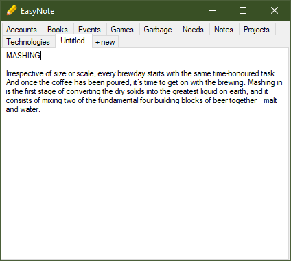

# EasyNote

Simple notepad with tabs. With this application you can store all your random txt files in one place with convenient way to edit them. This app saves its state like position, size and last used note. With autorun feature it's one of the best simplest solutions!

## Features

* Convenient tabs to switch between files
* Text autosaving
* Hiding tabs without deleting information
* Displaying app in a previously saved location with a specific size
* Opening on the last used tab

## Controls

- `MMB` on tab to "hide" it
- `Shift + MMB` to remove tab and delete file with data

## Screenshots

